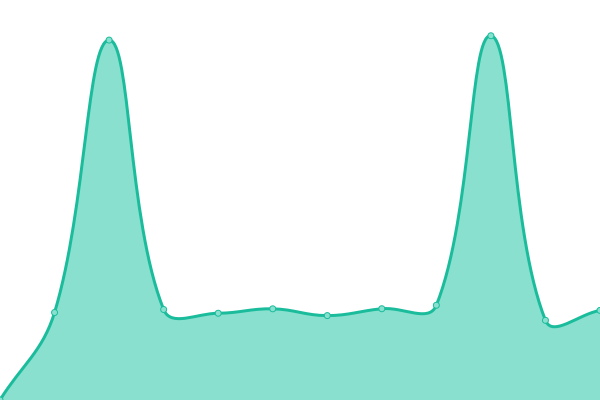
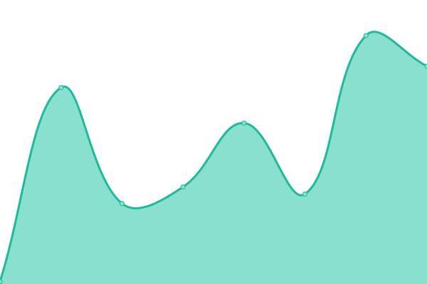

# [📈 Live Status](https://status.milansachani.dev): <!--live status--> **🟩 All systems operational**

This repository contains the open-source uptime monitor and status page for [Milan Sachani](https://milansachani.dev), powered by [Upptime](https://github.com/upptime/upptime).

With [Upptime](https://upptime.js.org), you can get your own unlimited and free uptime monitor and status page, powered entirely by a GitHub repository. We use [Issues](https://github.com/Milan-960/uptime/issues) as incident reports, [Actions](https://github.com/Milan-960/uptime/actions) as uptime monitors, and [Pages](https://status.milansachani.dev) for the status page.

<!--start: status pages-->
<!-- This summary is generated by Upptime (https://github.com/upptime/upptime) -->
<!-- Do not edit this manually, your changes will be overwritten -->
<!-- prettier-ignore -->
| URL | Status | History | Response Time | Uptime |
| --- | ------ | ------- | ------------- | ------ |
|  [Milan Portfolio](https://www.milansachani.dev) | 🟩 Up | [milan-portfolio.yml](https://github.com/Milan-960/uptime/commits/HEAD/history/milan-portfolio.yml) | 

 149ms
     
 | 

<a href="https://status.milansachani.dev/history/milan-portfolio">100.00%</a>
    

|  [Milan blog](https://blog.milansachani.dev) | 🟩 Up | [milan-blog.yml](https://github.com/Milan-960/uptime/commits/HEAD/history/milan-blog.yml) | 

 181ms
     
 | 

<a href="https://status.milansachani.dev/history/milan-blog">94.22%</a>
    

|  [Bingo Game](https://bingo.milansachani.dev) | 🟩 Up | [bingo-game.yml](https://github.com/Milan-960/uptime/commits/HEAD/history/bingo-game.yml) | 

 120ms
     
 | 

<a href="https://status.milansachani.dev/history/bingo-game">51.89%</a>
    

|  [Moonlight Movie](https://moonlight.milansachani.dev) | 🟩 Up | [moonlight-movie.yml](https://github.com/Milan-960/uptime/commits/HEAD/history/moonlight-movie.yml) | 

 116ms
     
 | 

<a href="https://status.milansachani.dev/history/moonlight-movie">37.97%</a>
    

|  [Nodejs Swagger API](https://nodejs-swagger-api.vercel.app) | 🟩 Up | [nodejs-swagger-api.yml](https://github.com/Milan-960/uptime/commits/HEAD/history/nodejs-swagger-api.yml) | 

 1835ms
     
 | 

<a href="https://status.milansachani.dev/history/nodejs-swagger-api">100.00%</a>
    

|  [Nestjs Swagger API](https://nestjs-server-member.vercel.app) | 🟩 Up | [nestjs-swagger-api.yml](https://github.com/Milan-960/uptime/commits/HEAD/history/nestjs-swagger-api.yml) | 

 6230ms
     
 | 

<a href="https://status.milansachani.dev/history/nestjs-swagger-api">4.42%</a>
    

|  [Img Text generator](https://img-text-generators.netlify.app) | 🟩 Up | [img-text-generator.yml](https://github.com/Milan-960/uptime/commits/HEAD/history/img-text-generator.yml) | 

 57ms
     
 | 

<a href="https://status.milansachani.dev/history/img-text-generator">100.00%</a>
    

|  [Live Weather app](https://live-weather-app-pwa.netlify.app) | 🟩 Up | [live-weather-app.yml](https://github.com/Milan-960/uptime/commits/HEAD/history/live-weather-app.yml) | 

 86ms
     
 | 

<a href="https://status.milansachani.dev/history/live-weather-app">100.00%</a>
    

|  [Stone Paper Scissors Game](https://stone-papers-scissors.netlify.app) | 🟩 Up | [stone-paper-scissors-game.yml](https://github.com/Milan-960/uptime/commits/HEAD/history/stone-paper-scissors-game.yml) | 

 143ms
     
 | 

<a href="https://status.milansachani.dev/history/stone-paper-scissors-game">100.00%</a>
    

|  [Astro Starter Kit Blog](https://astro-starter-kits.vercel.app) | 🟩 Up | [astro-starter-kit-blog.yml](https://github.com/Milan-960/uptime/commits/HEAD/history/astro-starter-kit-blog.yml) | 

 84ms
     
 | 

<a href="https://status.milansachani.dev/history/astro-starter-kit-blog">100.00%</a>
    

|  [Cryptoverse](https://thecrypoverse.netlify.app) | 🟩 Up | [cryptoverse.yml](https://github.com/Milan-960/uptime/commits/HEAD/history/cryptoverse.yml) | 

 65ms
     
 | 

<a href="https://status.milansachani.dev/history/cryptoverse">100.00%</a>
    

<!--end: status pages-->

[**Visit our status website →**](https://status.milansachani.dev)

## 📄 License

- Powered by: [Upptime](https://github.com/upptime/upptime)
- Code: [MIT](./LICENSE) © [Anand Chowdhary](https://anandchowdhary.com), supported by [Pabio](https://pabio.com)
- Data in the `./history` directory: [Open Database License](https://opendatacommons.org/licenses/odbl/1-0/)
